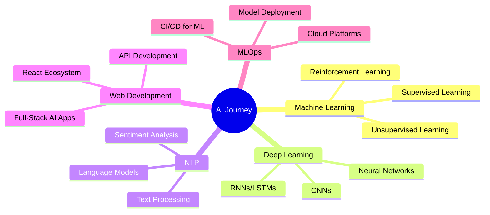

# 🚀 Mohamed Tamer | Future AI Innovator

<div align="center">


[](https://linkedin.com/in/mohamed-tamer-nassr)
[](mailto:mohamed.tamer.nassr@gmail.com)
[](https://mohamed-tamer-portfolio.vercel.app)
[](https://github.com/Mohamed-Tamer-Nassr)

</div>

---

## 🌟 About Me

```typescript
const mohamedTamer = {
  identity: "AI Innovator & Future-Builder",
  location: "Egypt 🇪🇬",
  education: "AI Student @ Benha University",
  mission: "Transforming imagination into intelligent reality",
  
  mindset: {
    learning: "Every dataset tells a story",
    building: "Every model shapes the future", 
    growing: "Every bug is a stepping stone"
  },
  
  currentFocus: ["Machine Learning", "Deep Learning", "NLP", "MLOps"],
  dreamJob: "AI Research Scientist | ML Engineer",
  lifePhilosophy: "The future belongs to those who train it."
};
```

> 💡 **I'm not just learning AI — I'm living it, breathing it, and building it into tomorrow's reality.**

---

## 🎯 What Drives Me

<table>
<tr>
<td width="50%">

### 🧠 **The Learning Journey**
- 🔬 Diving deep into **Neural Networks**
- 📊 Mastering **Data Science** fundamentals  
- 🤖 Building **intelligent systems**
- 🌐 Creating **AI-powered web experiences**

</td>
<td width="50%">

### 🚀 **The Building Process**
- ⚡ **Fast learner** with hands-on approach
- 🔧 **Problem solver** who loves challenges
- 🤝 **Collaborator** seeking real-world impact
- 📈 **Growth mindset** in everything I do

</td>
</tr>
</table>

---

## 💻 Tech Arsenal

<div align="center">

### 🏗️ **Software Architecture**


### 🧠 **AI & Data Science**


### 🎯 **Software Principles**


### 🛠️ **Tools & Platforms**


</div>

---

## 🎯 Focus Areas

<div align="center">



</div>

---

## 🌱 Current Learning Path

<details>
<summary><b>🔥 Advanced ML & Deep Learning</b></summary>

- 📚 **Neural Network Architectures**: CNNs, RNNs, Transformers
- 🎯 **Advanced Algorithms**: Gradient Boosting, Ensemble Methods
- 🧪 **Research Papers**: Implementing cutting-edge techniques
- 💡 **Personal Projects**: Building from scratch to understand deeply

</details>

<details>
<summary><b>☁️ MLOps & Deployment</b></summary>

- 🚀 **Model Deployment**: Docker, Kubernetes, Cloud Platforms  
- 📊 **Monitoring & Maintenance**: Model performance tracking
- 🔄 **CI/CD Pipelines**: Automated ML workflows
- 🛡️ **Security & Scalability**: Production-ready solutions

</details>

<details>
<summary><b>🌐 Full-Stack AI Integration</b></summary>

- ⚡ **FastAPI**: Building lightning-fast AI APIs
- 🔗 **React + AI**: Seamless frontend-backend integration  
- 📱 **Real-time Apps**: WebSocket connections for live AI
- 🎨 **UI/UX**: Making AI accessible and beautiful

</details>

---


## 🤝 Let's Build the Future Together

<div align="center">

### 🎯 **I'm actively seeking:**

| 🚀 **Opportunities** | 🤝 **Collaborations** | 🌟 **Connections** |
|:---:|:---:|:---:|
| AI/ML Internships | Open Source Projects | Fellow AI Enthusiasts |
| Research Projects | Startup Ventures | Industry Mentors |
| Hackathons | Real-world Applications | Global Communities |


</div>

---

<div align="center">

### 🌟 **"The future belongs to those who train it."**
*— Mohamed Tamer*

